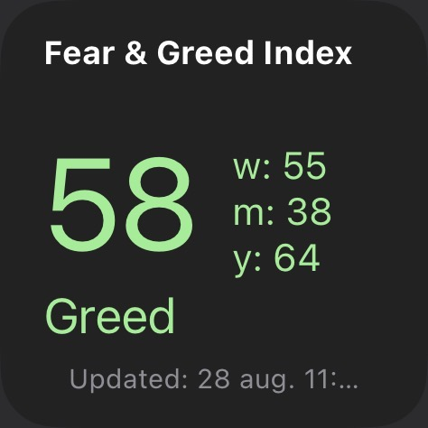
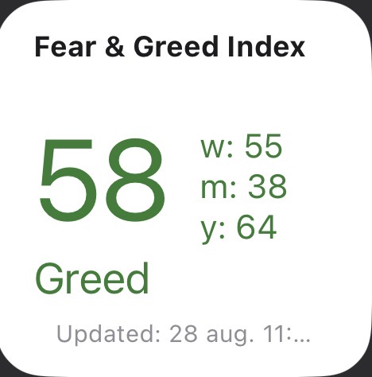
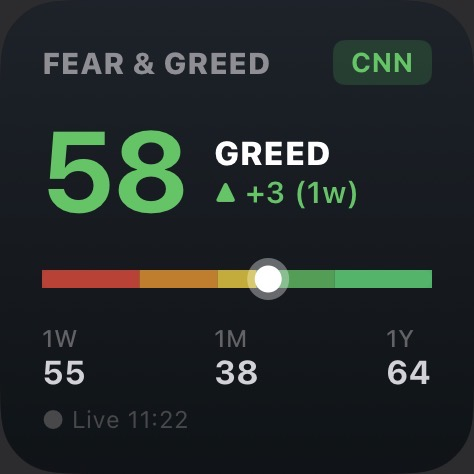
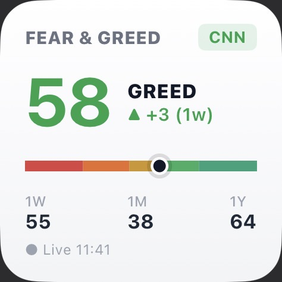

# iOS Fear & Greed Index Widget

A lightweight, zero-dependency iOS Home Screen widget for [Scriptable](https://scriptable.app) that tracks CNN Business's Fear & Greed Index in real time.

Includes offline caching, dynamic multi-zone visual gauge rendering, trend deltas, and support for both small and medium widget families.

---

## Preview

| Classic Dark | Classic Light |
| :---: | :---: |
|  |  |
| **Modern Dark** | **Modern Light** |
|  |  |

---

## Project Structure

```
├── widgets/
│   ├── classic/
│   │   ├── fear-and-greed-classic-dark.js
│   │   └── fear-and-greed-classic-light.js
│   └── modern/
│       ├── fear-and-greed-modern-dark.js
│       └── fear-and-greed-modern-light.js
├── screenshots/
│   ├── classic-dark.jpg
│   ├── classic-light.jpg
│   ├── modern-dark.jpg
│   └── modern-light.jpg
└── test/
    ├── all_variants_test.js
    ├── e2e_widget_test.js
    └── widget_test.js
```

---

## Setup & Installation

1. Install **[Scriptable](https://apps.apple.com/app/scriptable/id1405459188)** from the App Store.
2. Open Scriptable, tap **`+`** (new script), and paste the code from your preferred variant inside `widgets/`:
   - `widgets/modern/fear-and-greed-modern-dark.js` *(Recommended)*
   - `widgets/modern/fear-and-greed-modern-light.js`
   - `widgets/classic/fear-and-greed-classic-dark.js`
   - `widgets/classic/fear-and-greed-classic-light.js`
3. Name the script `Fear & Greed`.
4. Go to your iOS Home Screen, add a **Scriptable widget** (Small or Medium), long-press the widget, tap **Edit Widget**, and select `Fear & Greed`.

---

## Tests

Run the headless VM test suite:

```bash
node test/all_variants_test.js
```
